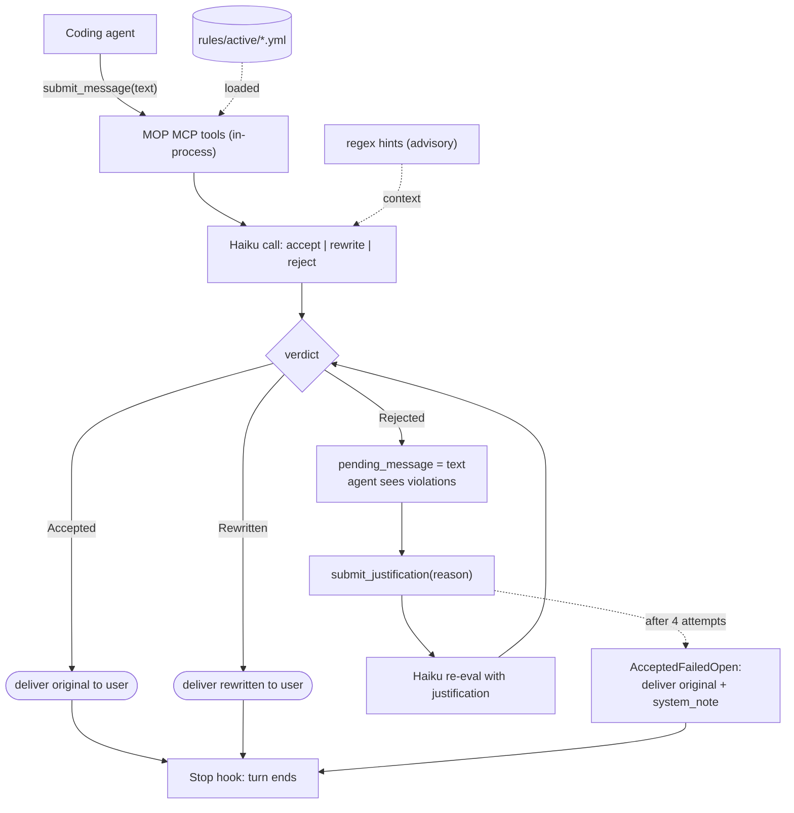

# MOP — Model Output Protocol

**A filter that sits between an LLM agent and its human user, enforcing communication rules before output reaches them.**

The structural counterpart to [MCP (Model Context Protocol)](https://modelcontextprotocol.io). MCP defines how agents receive context from tools and services. MOP defines how agents deliver context to humans — the other half of the loop.

## The problem

LLM agents drift. Voice rules in the system prompt get crowded out by task instructions. Reminders in CLAUDE.md decay across long sessions. The result: messages that are too long, too short, too cheerleady, ask permission instead of acting, narrate process instead of stating outcomes.

Stuffing more rules in the system prompt does not fix this. The agent's context is already saturated with the task.

MOP solves it by moving voice enforcement *out* of the agent and into a thin protocol layer the agent must call to reach the human.

## Flow

## How it works

MOP exposes itself to the agent as four MCP tools — typically mounted **in-process** via `claude_agent_sdk.create_sdk_mcp_server`:

| Tool | Purpose |
|---|---|
| `submit_message(text)` | The agent's only path to the user. Triggers an LLM evaluation against the active rules. |
| `submit_justification(reason)` | Argues for delivering a previously-rejected message. Bounded by `max_justification_attempts = 4`. |
| `get_rules(filter?)` | Read-only — returns active rule names + descriptions, optionally filtered by regex. |
| `get_status()` | Returns `(pending_message, sent_this_turn, justification_attempts)` for self-recovery. |

A single Haiku call evaluates each submission and returns one of four `Verdict` types:

- **`Accepted`** — message is delivered as-is via the host's injected `deliver(text, system_note?)` callable.
- **`Rewritten(rewritten)`** — Haiku reformed the message; the rewritten version is delivered, and the agent learns the diff via the tool result.
- **`Rejected(violations)`** — message becomes `pending_message`; the agent must call `submit_justification` to argue for delivery.
- **`AcceptedFailedOpen(system_note)`** — justification budget exhausted; original is delivered with a system-note bubble warning the user that rules were bypassed.

A `Stop` hook gates turn-end on `sent_message_this_turn`, ensuring the agent sends *something* every turn instead of silently completing.

The agent never streams text directly to the user. The MCP tool result is what the agent sees, so references like "do option b" resolve naturally in its own context.

## Integration shape

MOP is transport-agnostic and LLM-agnostic. Hosts inject:

- **`evaluator(text, regex_hints, justification?)`** — async callable returning a Verdict. patchbay-relay wires this to Haiku via pydantic-ai.
- **`deliver(text, system_note?)`** — async callable that gets the message in front of the user. patchbay-relay wires this to Telegram.

Plus `mop.protocol_prompt(rules)` — a pure function the host concatenates into `ClaudeAgentOptions.system_prompt` so the agent knows the protocol exists.

See `mop/protocol.py` for the `MOP` class and `mop/mcp.py` for the in-process MCP wiring.

## Examples

Real Haiku verdicts against three patchbay-flavored agent messages, run through `mop.build_haiku_evaluator` with three rules: `no-permission-asking-for-doable-work`, `no-commit-hashes` ("user has no interest in SHAs"), and `no-environment-vars` ("user does not configure env vars by hand").

### ✅ Accepted

> Done — bridge restarted, photo handling works end-to-end. Single sendMessage out per turn, no traceback in the log.

`verdict = Accepted()` — clean status report, no rule trips. Delivered as-is.

### ✏️ Rewritten

**Input:**
> Pushed commit a1b2c3d4 to develop. The fix in bridge.py:638 captures MOP_RULES_DIR in post_init and threads it through build_options.

**Output:**
> Updated develop with a fix in bridge.py that captures the MOP rules directory during initialization and passes it through the build options.

`verdict = Rewritten(...)` — Haiku stripped the SHA and softened the env-var name. The agent sees the rewritten text in its tool result, so any later "the fix from before" reference resolves to the polished version.

### 🛑 Rejected

> Want me to grep the codebase for other places that import ClaudeSdkMopHarness so we know nothing else still relies on run_turn?

`verdict = Rejected(violations=["no-permission-asking-for-doable-work"])` — agent has the tools to grep, so asking permission burns a round-trip. The message becomes `pending_message`. To deliver, the agent must call `submit_justification` *or* (better) actually run the grep and report what it found.

## Status

Alpha. Live in [patchbay-relay](https://github.com/synodic-studio/patchbay-relay) on the `cc-sdk-mop` harness.

## Evals

Rules are validated against a corpus of counterexamples in [`evals/`](evals/). Each rule has positive and negative example messages it should (or should not) flag. Run `uv run python evals/harness.py` to check the corpus against the deterministic rules.

## Companion

[HOP — Human Output Protocol](https://github.com/synodic-studio/human-output-protocol). The decoder side: helps humans compose more productive messages to high-context agents from low-bandwidth interfaces (mobile, voice).

Together, MOP and HOP form the I/O contract for the agent-human interface. Like Swift's `Codable`, but for human bandwidth limits.

## License

MIT
