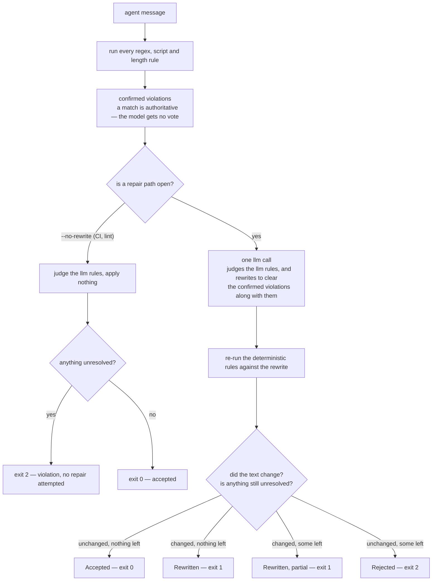
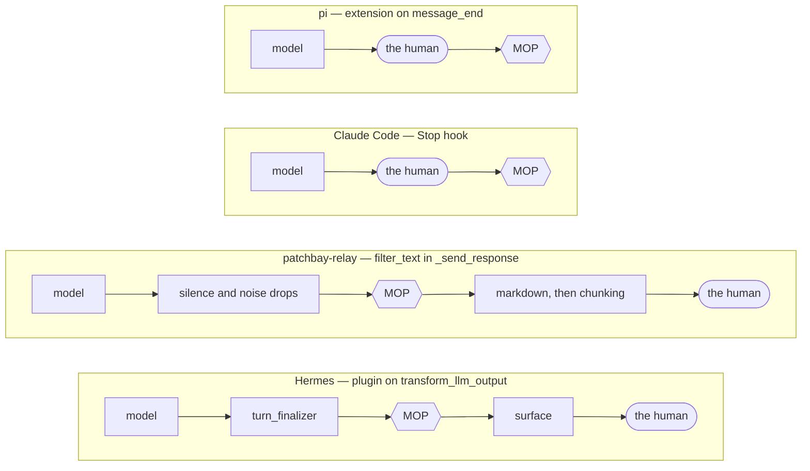
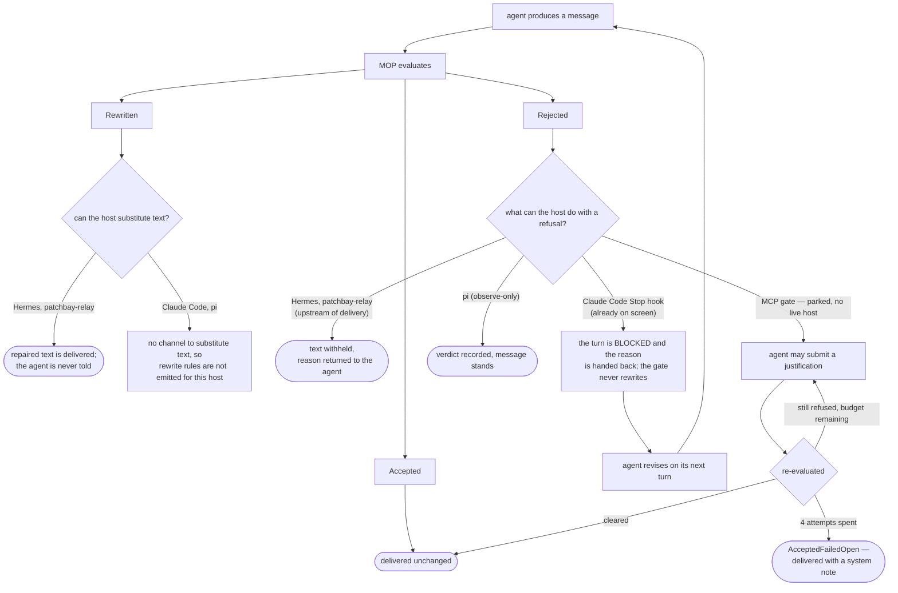

# MOP — Model Output Protocol

**A filter that sits between an LLM agent and its human user, enforcing communication rules before output reaches them.**

The name is a wink at the [Model Context Protocol](https://modelcontextprotocol.io), nothing more. MOP is not a protocol in that sense and has nothing to do with MCP beyond the pun. It is a filtering layer: a gate every agent message passes through before it reaches the user.

## The problem

LLM agents drift. Voice rules in the system prompt get crowded out by task instructions. Reminders in CLAUDE.md decay across long sessions. The result: messages that are too long, too cheerleady, ask permission instead of acting, delegate work back to the user, narrate process instead of stating outcomes.

Stuffing more rules in the system prompt does not fix this — the agent's context is already saturated with the task. MOP moves voice enforcement *out* of the agent and into a thin layer that inspects each message.

## Two surfaces

MOP is one core (`mop.rules`, `mop.evaluators`, `mop.types`) with two ways to call it:

1. **`mop check` — a stateless CLI** (the primary, shipped path). Pipe a message in, get a verdict and exit code out. No agent runtime, no MCP server. This is how a host gates outbound text.
2. **In-process MCP gate** (`mop/protocol.py`, `mop/mcp.py`) — a stateful adapter exposing `submit_message` / `submit_justification` as MCP tools, with a justification loop and failed-open. **Parked pending an Agent-SDK host** (e.g. Claude Code on `claude_agent_sdk`): it is not deterministic-authoritative and no live integration uses it. When one arrives it will be rebuilt as a thin state wrapper around `mop check`, so verdict semantics live in one engine. See ADR-0005 and `docs/mop-enforce-decision.md` (Issue 2).

## How evaluation works

Rules carry one of four **detectors**:

| Detector | Fires when | Authority |
|---|---|---|
| `llm` | the evaluator model judges it does (carries a `prompt`) | model call |
| `regex` | a declarative pattern matches (`patterns`) | **deterministic — authoritative** |
| `script` | an external command exits non-zero (`command`, message on stdin) | **deterministic — authoritative** |
| `length` | a char/word cap is exceeded (`max_chars`/`max_words`) | **deterministic — authoritative** |

A single evaluation runs the deterministic rules first (a match is a hard violation the model cannot wave away), then **one** LLM call judges the `llm` rules and produces a best-effort rewrite that also repairs the deterministic hits. The deterministic rules are re-checked against the rewrite.



Both paths through that diamond can end at exit 2, and they do not mean the same thing. Under `--no-rewrite` nothing was ever offered a repair; under the full path a repair was attempted and did not clear.

The **verdict is derived**, never declared by the model — computed from *(did the text change? is `unresolved` empty?)*:

- **`Accepted`** — nothing changed, nothing unresolved.
- **`Rewritten(rewritten, unresolved)`** — the evaluator rewrote it; `unresolved` lists anything it couldn't fix (the "partial" case).
- **`Rejected(unresolved)`** — nothing was fixable; the residual violations are the agent's to handle.
- **`AcceptedFailedOpen(system_note)`** — MCP-gate-only escape hatch after the justification budget is exhausted.

See [`docs/adr/`](docs/adr/) for the decisions behind all of this, and [`CONTEXT.md`](CONTEXT.md) for the glossary.

## CLI

```bash
echo "Sounds great, shipping it!" | mop check --json      # verdict + exit code
mop check --file draft.md --builtins                       # include packaged rules
mop check --no-rewrite < draft.md                          # judge only (CI/lint)
mop rules list --builtins                                  # inspect the resolved rule set
```

- **Exit codes:** `0` accepted, `1` rewritten, `2` rejected, `3` usage/runtime error.
- **Built-ins are opt-in:** `mop check` runs only your local `.mop/` rules unless you pass `--builtins`. With no rules at all it warns `no active rules — MOP enforced nothing` and accepts (exit 0) — it never imposes defaults or hard-fails a fresh repo.
- **`--rules-dir` is a promise, not a hint:** a path named on the command line that is missing, unreadable, or holds no `*.yml` is an error (exit 3). MOP will not quietly resolve to the built-in lint and report success on a rule set that never ran.
- **`.mop/` discovery:** walks up from the cwd to the first `.git` ancestor. Local rules layer over the (opt-in) built-ins — same-name replaces, `active: false` silences.
- **Observability:** set `MOP_AUDIT_LOG=<dir>` to append every verdict to a daily-rotated JSONL flight recorder.

See [`mop/cli.py`](mop/cli.py).

## Evaluator

MOP calls [litellm](https://github.com/BerriAI/litellm) in-process and owns its own tier aliases (`mop.evaluators.MODEL_ALIASES`): `small` (default) = `deepseek/deepseek-v4-flash`, with provisional `medium`/`large`. Select with `--model <tier|provider/model>` or `MOP_EVALUATOR_MODEL`. Structured output degrades gracefully across providers (json_schema → json_object → prompt-only), validated by pydantic. MOP is evaluator-agnostic — a host can inject any callable matching the `Evaluator` signature.

## Integration shape (MCP gate)

For the stateful gate, hosts inject an `evaluator` (built via `mop.build_evaluator(rules=...)`) and a `deliver(text, system_note?)` callable for whatever channel they own (Telegram, Slack, web socket). `mop.protocol_prompt(rules)` returns a system-prompt fragment so the agent knows the protocol exists. See `mop/protocol.py` and `mop/mcp.py`.

## Evals

Rules are validated against a counterexample corpus in [`evals/`](evals/) — positive and negative example messages each rule should (or should not) flag. Run `uv run python evals/harness.py` for the deterministic rules, add `--llm` (and an API key) for `llm` rules, or `--rule <name>` to target one.

## Where MOP sits in each host's message lifecycle

What a host can enforce is decided entirely by the seam it exposes. Two of these hand over the text before the human sees it; the other two only ever see it on the way past.



- **Hermes and patchbay-relay put MOP upstream of delivery**, so a rewrite or a rejection can still change what arrives. Hermes streams progressively, so a rewrite lands as an *edit* to a message the reader already glimpsed — fine for a rewrite, a real gap for a redaction, and the reason gated surfaces want streaming off.
- **Claude Code and pi have no seam that can *substitute* the final text.** Claude Code's hook surface covers tool calls and turn boundaries, not assistant messages; pi emits outgoing text only through observe-only events, after streaming. Claude Code still gets a corrective gate out of this — a Stop hook can block the turn and hand back reasons, so the agent fixes its own message on the next one. pi's `message_end` carries no result, so there it is record-only. Substitution there means gating downstream, which is what patchbay-relay does when it dispatches pi.

That asymmetry is the reason the deployment split below exists at all.

### What each verdict can actually do, per host

A verdict is only worth as much as the host's ability to act on it. Same engine, same four outcomes, four different endings.



Two loops there are worth separating.

- **Claude Code's is real and running in this repo.** [`.claude/settings.json`](.claude/settings.json) carries a generated Stop hook that judges the turn's final message against the `reject`-disposition rules and blocks the turn with concrete instructions when one fires. The agent fixes it on the next turn. Because the message is already on screen and there is no substitution channel, `rewrite` rules are deliberately left out — blocking a turn over a wording change spends the reader's attention on exactly what the gate was supposed to absorb. Regenerate with [`scripts/gen_cc_hook.py`](scripts/gen_cc_hook.py) after changing rules, and restart the session; hooks load once at startup.
- **The MCP justification loop is parked, but it did run.** `submit_message` / `submit_justification` in [`mop/protocol.py`](mop/protocol.py) let an agent argue its case up to `max_justification_attempts` (default 4) before the gate fails open and delivers the original with a system note. It was mounted in-process in patchbay-relay's `cc-sdk-mop` harness and went out with that harness when the bridge became pi-only — so what's parked is a path that carried real traffic, not a sketch. It predates the two-phase engine and is not deterministic-authoritative, which is why it stays parked rather than being revived piecemeal: the loop design is worth keeping, the verdict logic is not. See ADR-0005.

## Recording everywhere, acting only here

The two are deliberately separate deployments, because a rule set earns the right to change what a human sees by being right about real traffic first.

- **Recording** is machine-wide. Every host gate runs `MOP_MODE=log` against a machine-local rule set of deterministic detectors only, judged with `--no-rewrite`: it costs no model call, adds no latency, and never alters a message. Its whole job is to fill the flight recorder with real verdicts that [`scripts/mine_audit.py`](scripts/mine_audit.py) turns back into counterexamples.
- **Acting** is scoped to this repo. [`.mop/rules.yml`](.mop/rules.yml) carries the full set — both dispositions, model-judged rules included — and `.mop/` discovery stops at the first `.git` ancestor, so it resolves from anywhere in this tree and from nowhere else. [`.claude/settings.json`](.claude/settings.json) installs the generated blocking Stop hook for Claude Code sessions started here, and only here.

Nothing outside this repo rewrites or withholds an agent's message. Flipping that is a per-host `MOP_MODE` env var, documented in [`docs/integration.md`](docs/integration.md) and deliberately not yet taken.

## Demo

`scripts/demo.sh` is a guided tour of the gate: what fires with no model at all, what one model call repairs, what no rewrite can fix, what passes untouched, and the flight recorder the run just wrote. Every message on screen is read out of the counterexample corpus, harvested from live agent sessions. `--auto` runs it start to finish for rehearsal; `--offline` skips the model beats. Evaluator settings come from `scripts/demo.env` — see `scripts/demo.env.example`.

## Status

Alpha. Core + `mop check` CLI shipped and tested. Four hosts run the same gate at their delivery chokepoint — Hermes and [patchbay-relay](https://github.com/synodic-studio/patchbay-relay) as in-process plugins, Pi as an extension, Claude Code as a Stop hook — all in log mode against a deterministic rule set, writing to a shared JSONL flight recorder. Enforcement is a per-host env flip, deliberately not yet taken. See [`docs/integration.md`](docs/integration.md).

## Companion

[HOP — Human Output Protocol](https://github.com/synodic-studio/human-output-protocol). The decoder side: helps humans compose more productive messages to high-context agents from low-bandwidth interfaces (mobile, voice). Together, MOP and HOP form the I/O contract for the agent-human interface.

## License

MIT
