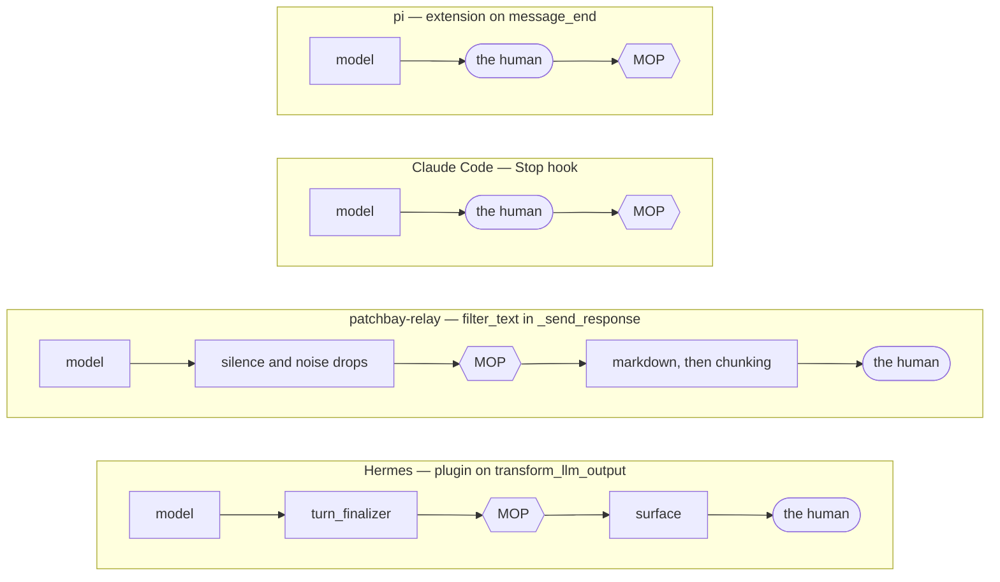
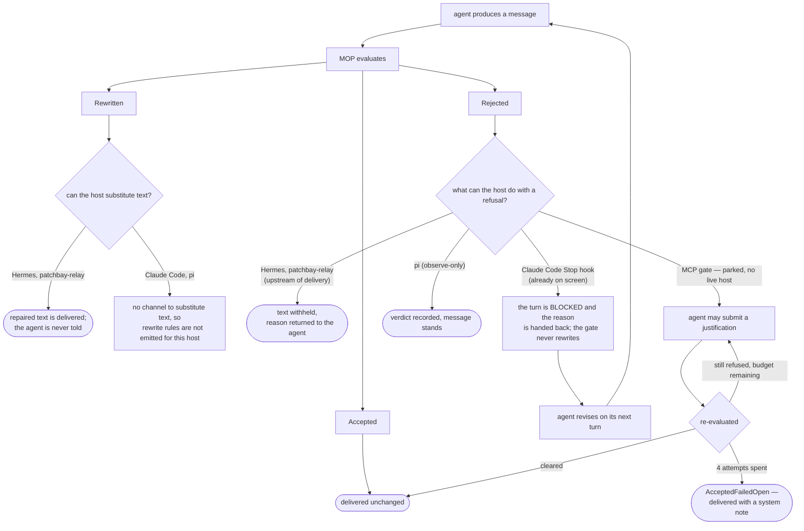
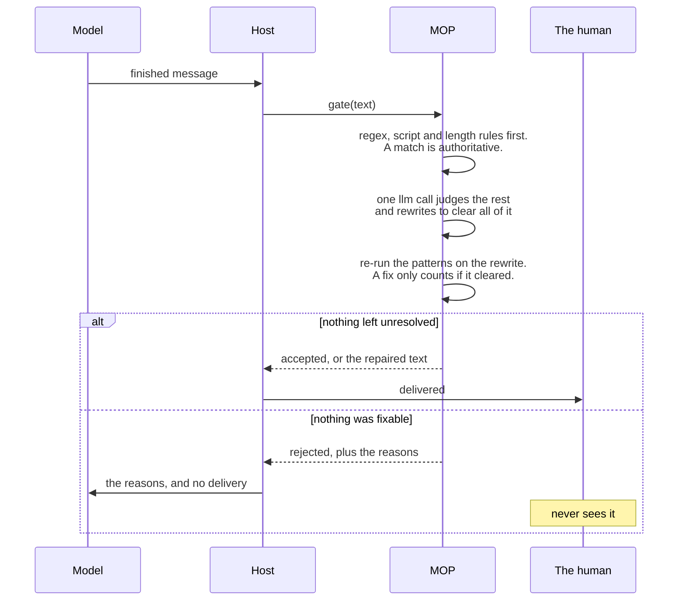
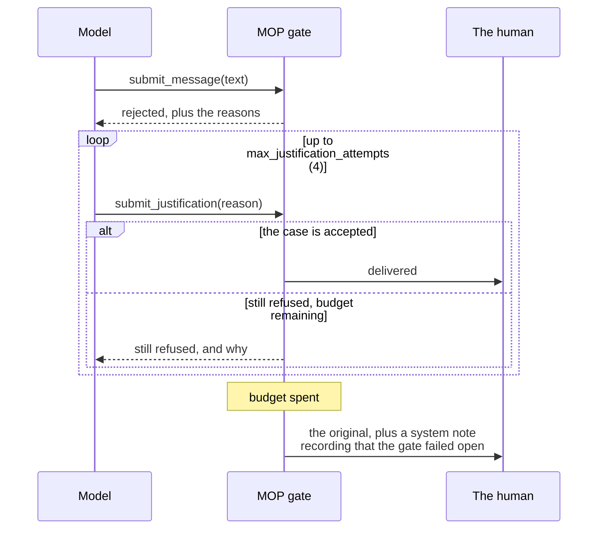

# Where MOP sits, and what each verdict can do

One engine, four verdicts, and four different endings depending on what the host can actually do with one. [`docs/integration.md`](integration.md) is the per-host how-to; this is the shape of the thing.

## Where the gate sits

What a host can enforce is decided entirely by the seam it exposes. Two of these hand over the text before the human sees it; the other two only ever see it on the way past.

- **Hermes and patchbay-relay put MOP upstream of delivery**, so a rewrite or a rejection can still change what arrives. Hermes streams progressively, so a rewrite lands as an *edit* to a message the reader already glimpsed — fine for a rewrite, a real gap for a redaction, and the reason gated surfaces want streaming off.
- **Claude Code and pi have no seam that can *substitute* the final text.** Claude Code's hook surface covers tool calls and turn boundaries, not assistant messages; pi emits outgoing text only through observe-only events, after streaming. Claude Code still gets a corrective gate out of this — a Stop hook can block the turn and hand back reasons, so the agent fixes its own message on the next one. pi's `message_end` carries no result, so there it is record-only. Substitution there means gating downstream, which is what patchbay-relay does when it dispatches pi.

That asymmetry is the reason for the log-everywhere / act-here split described in the README.

## What each verdict can actually do, per host

A verdict is only worth as much as the host's ability to act on it. Same engine, same four outcomes, four different endings.

Two loops there are worth separating.

- **Claude Code's is real and running in this repo.** [`.claude/settings.json`](.claude/settings.json) carries a generated Stop hook that judges the turn's final message against the `reject`-disposition rules and blocks the turn with concrete instructions when one fires. The agent fixes it on the next turn. Because the message is already on screen and there is no substitution channel, `rewrite` rules are deliberately left out — blocking a turn over a wording change spends the reader's attention on exactly what the gate was supposed to absorb. Regenerate with [`scripts/gen_cc_hook.py`](scripts/gen_cc_hook.py) after changing rules, and restart the session; hooks load once at startup.
- **The MCP justification loop is parked, but it did run.** `submit_message` / `submit_justification` in [`mop/protocol.py`](mop/protocol.py) let an agent argue its case up to `max_justification_attempts` (default 4) before the gate fails open and delivers the original with a system note. It was mounted in-process in patchbay-relay's `cc-sdk-mop` harness and went out with that harness when the bridge became pi-only — so what's parked is a path that carried real traffic, not a sketch. It predates the two-phase engine and is not deterministic-authoritative, which is why it stays parked rather than being revived piecemeal: the loop design is worth keeping, the verdict logic is not. See ADR-0005.

## Two shapes, in sequence

The difference that matters is not which host it is. It is whether the gate sits **in the pipe** the message already travels, or is **a tool the model has to call**.

### Shape 1 — the gate is in the pipe

The model has no idea it exists. The host hands the finished text over on its way out, and whatever comes back is what ships. This is Hermes and patchbay-relay today, and it is what pi would be if `message_end` ever carried a result.

The agent is only ever told about a rejection. A rewrite is silent by design: if the gate could fix it, spending a turn telling the model so buys nothing.

### Shape 2 — the gate is a tool the model calls

The model submits its message and gets a verdict back, so it can argue. That argument is the whole point: a gate with no appeal gets routed around, and one that can be talked past isn't a gate. The budget is what squares them — the model gets a bounded number of attempts, and when they run out the message ships with a note saying it did.

`AcceptedFailedOpen` is the verdict that only exists here. Shape 1 has no equivalent because there is nobody to argue with.

Claude Code is a third thing, and closer to Shape 2 than it looks: a Stop hook cannot substitute text, but it can refuse to let the turn end and hand back reasons, so the model repairs its own message on the next turn. The appeal loop is the conversation itself.
